

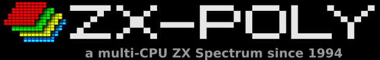

# Changelog
- __2.0.4 (SNAPSHOT)__
  - added support of beeper (turned off by default)
  - added more ROM sources
  - fixed ROM loading from WoS
  - improved CPU sync in Spec256
  
- __2.0.3 (31-dec-2019)__
  - added mix of colors with attribute colors in Spec256 mode
  - fixed wrong default BackOverFF flag value in Spec256 loading

- __2.0.2 (21-dec-2019)__
  - fixed IFF restore bug in SNA open-write
  - minor emulator GUI improvements
  
# Introduction
I am a ZX-Spectrum fun since 1989. ZX-Spectrum platform was very popular in the USSR. In april of 1994 I got some idea how to resolve [attribute clash](https://en.wikipedia.org/wiki/Attribute_clash) through moving the platform from mono-system to poly-system.   

The idea was to start four ZX-Spectrum-128 in parallel with small modifications of graphics data. It didn't need any changes in ROM and SOS but only total synchronization between CPUs and sharing of all control signals.

I can't say that the idea was too original one because I was inspired by the book ["COMPUTER IMAGES" ("Understanding computer" Time-Life books)](https://youtu.be/rCkGOmcLSa0). There I found several strings about the Pixar platform (developed by the Lucasfilm team) which processes each color component by dedicated CPU. In Zx-Poly each CPU also processes dedicated color component (R,G,B,Y). Software no so often checks information written into VRAM so that big part of games and utilities could be adapted just through edition of their graphic data.   

# License
Both the concept and emulator and all its parts are published under [GNU GPL3 license](https://www.gnu.org/licenses/gpl-3.0.html).

# Emulator GUI
Keyboard plays role of ZX-Keyboard (ALT = SS, SHIFT = CS, CTRL+WHEEL = scaling), F5 shows ZX-keys on the screen. Numpad plays role of Kempson joystick.  
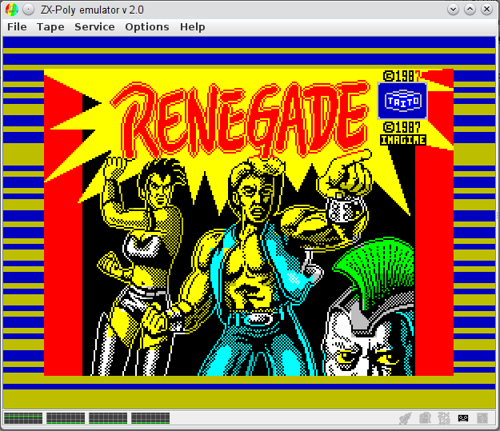

# Supported snapshot formats
 - Snapshots: .Z80, .SNA, .ZXP (ZX-Poly snapshot format), ZIP (Spec256 with SNA inside)
 - Tape: .TAP (allows export to WAV file)
 - Disks: .TRD, .SCL

# Prebuilt versions
The pre-built versions of the emulator and sprite editor can be downloaded from [the release page](https://github.com/raydac/zxpoly/releases/tag/2.0.2).   
The emulator is written in Java and its JAR file can be started just through command line `java -jar zxpoly-emul-2.0.2-SNAPSHOT.jar`   
By default it starts embedded ZX-Poly Test ROM image, but it can be replaced by ZX-128 SOS in **File->Options->Active ROM**, the ROM will be downloaded from one of remote network resources.   

# Theory and structure of the ZX-Poly platform
    
The base of the platform is the theory that stable synchronous systems (without any inside random processes) built on the same components (because different element base can be also source of random processes) by being started synchronously in the same time from the same state have the same state in any point of time if all synchronous system components get the same input signal states in the same time.   
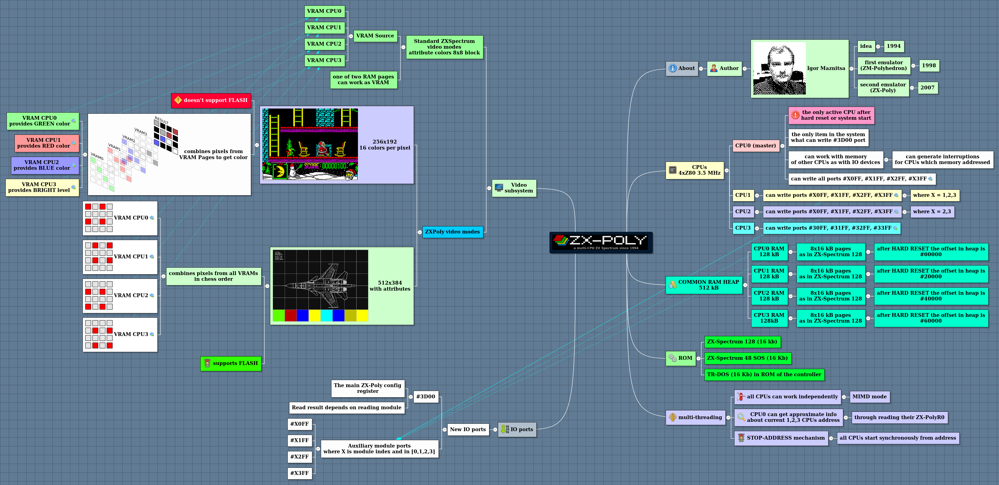
ZX-Poly platform adds several ports to manipulate work modes and the main port of the platform is #3D00. [In more details it is desribed in wiki.](https://github.com/raydac/zxpoly/wiki/Short-description-of-ZX-Poly-platform)

# Supported videomodes
## Standard ZX-Spectrum 256x192 (2 colors per pixel in 8x8 block) (mode 0,1,2,3)
It is just regular ZX-Spectrum mode 256x192 with 2 attributed colors for 8x8 pixel block.   
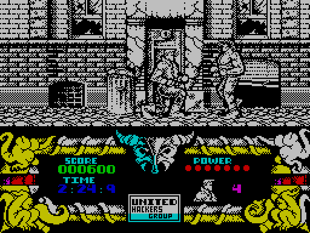

## ZX-Poly 256x192 (16 colors per pixel)
It is a family of video-modes and contain three sub-mode. All modes provide way for each pixel to get a color from standard ZX-Spectrum 16 color palette.

### ZX-Poly 256x192 STANDARD (mode 4)

It is just regular video mode without any masking. It just integrates pixel info from video-ram of all CPU modules and form 4 bit index in ZX-Spectrum palette.
[TRD disk with the example can be downloaded from here, the game has been partly colorized](adapted/Atw2/target/atw2.trd)   
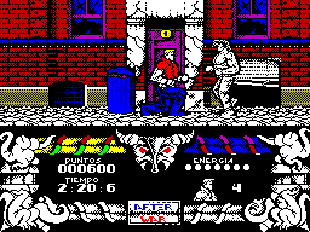   

### ZX-Poly 256x192 EXTENSION MASK_INK+PAPER (6)

It works as previous one and provide way to for 4 bit index for pixel, but also it analyses INK and PAPER colors from CPU0 video-ram and if INK = PAPER then whole block is filled by the INK color. It is made to provide way to make compatibility with games hidding some visual elements in areas with same INK and PAPER colors.

### ZX-Poly 256x192 EXTENSION MASK_FLUSH+INK+PAPER (mode 7)

It is the most complex from the video-mode family. It analyses FLASH bit of each attribute from CPU0 video-memory and turn on ZX-Poly mode only for blocks where FLASH bit is ON. In the same time it analyses INK and PAPER attribute values and if they the same then whole block is filled by INK else form pixel colors as in standard ZX-Poly mode. All blocks where FLASH is OFF are processed as in standard ZX-Spectrum video-mode. FLASH is not working in the mode (but it is no so often feature in games). The video-mode provides way to colorize games with color dynamic indicators and duotone game-play areas.   
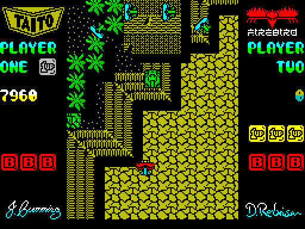

## ZX-Poly 512x384 (2 colors per pixel placed in chess order) (mode 5)
The Mode uses attributes but places pixels in chess order.   
[TRD disk with the example can be downloaded from here](adapted/ZxWord/target/zxword.trd)   
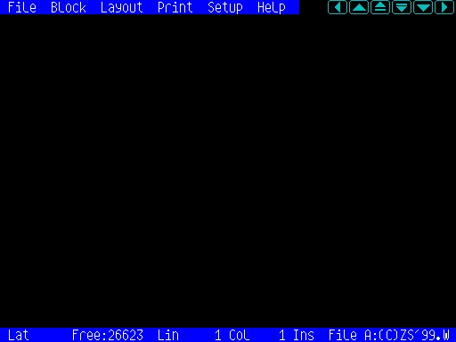

# Adaptation of games

To adapt old games, I have developed special utility called ZX-Poly Sprite corrector, which can be found in releases. It is a very easy editor which shows images in data blocks and allows to redraw them. It supports import from Z80 and SNA snapshots and as the result it generates ZXP snapshots.   
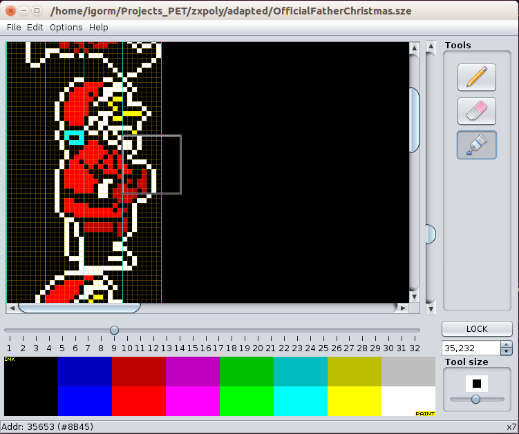

## "Official Father Christmas" (1989)
Original look of the game   
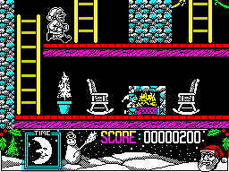

On Christmas 2017 I made some adaptation of the old game ["Official Father Christmas" (1989)](http://www.worldofspectrum.org/infoseekid.cgi?id=0003493) for ZX-Poly (mode 6). Of course not all was smoothly, some elements of third level could not be colorized because their colorization broke game process and made CPU modules out of sync, it looks like that the level contains some optimization in graphics processing for those elements and presented some check for empty areas to optimize speed.   
Adapted game version in ZX-Poly emulator format can be downloaded [from here](adapted/OfficialFatherChristmas/OFCZXPOLY.zxp).   
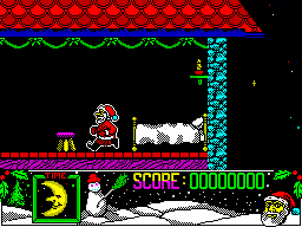

## "Adventures of Buratino" (1993) 
I was playing with adaptation of the game for 512x384 (mode 5), program code works well but the game and without adaptation is so colorful and detailed that big effect is not visible. Also it was impossible to adapt the main hero sprites because the same sprites are used for both right and left walk through mirroring.   
Adapted game version in ZX-Poly emulator format can be downloaded [from here](adapted/BuratinoAdventures/buratino_adventures.zxp).   
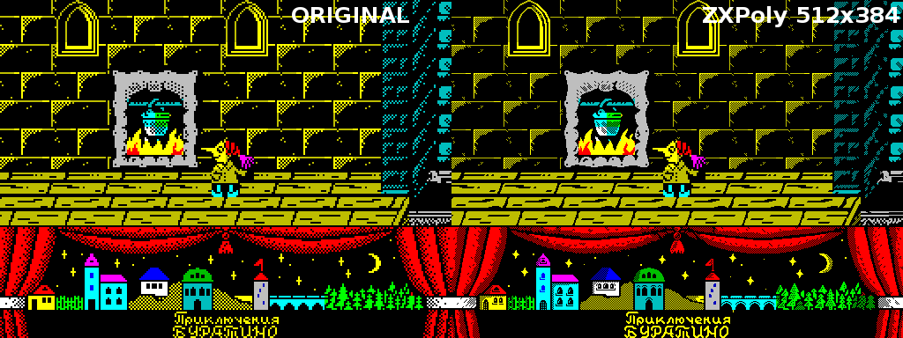

## "Flying Shark" (1987)
In november 2019, I made some adaptation of "Flying Shark" game for ZX-Poly 256x192 (mode 7). It shows possibility of combination of standard ZX-Spectrum colorization (for game panels) and ZX-Poly colorization (for game field). Snapshot for ZX-Poly emulator can be downloaded [from here](/adapted/FlyShark/flyshark.zxp).   

# Support of Spec256 emulation
Since 2.0.1 version, some restricted [Spec256 platform](http://www.emulatronia.com/emusdaqui/spec256/index-eng.htm) emulation added. Because there is real difference in work of ZX-Poly emulator (which based on parallel CPUs) and [Spec256](http://www.emulatronia.com/emusdaqui/spec256/index-eng.htm) (which based on CPU with 64bit virtual registers), not all games work well, but many of them can be started and playable.   
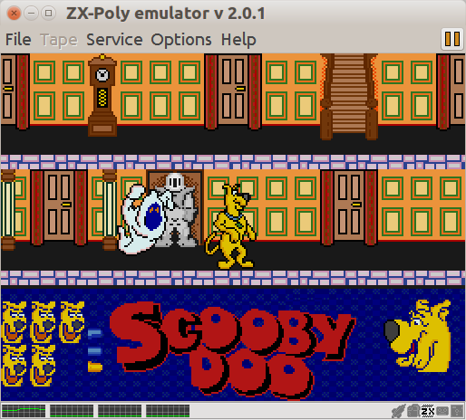

Known issues with emulation of listed games:
 - __Knight lore__ wrongly colored picture
 - __Bubbler__ losing colorization for some game elements
 - __Atic atac__ has some trash as footsteps of game elements

In ZX-Poly emulator working in Spec256 mode, some CPU registers are syncronized every iteration (by default PC, SP and bits of F excluding C bit), but it works not for all games. In games which need another register set, there can be provided special `zxpAlignRegs` parameter in CFG file situated in snapshot archive. For instance `zxpAlignRegs=XxYyPSsHLb` means syncronization of IX,IY,PC,SP,H,L and B' registers.

# F.A.Q.
## Is there a hardware implementation?
No, I had some negotiations with ZX-Spectrum clone manufacturers in Russia in the middle of 90th but I agreed with them that it was too late for market.

## Does the platform need a custom OS?
No, it doesn't. ZX-Poly uses standard ZX-Spectrum 128 OS + TR-DOS. On start ZX-Poly even starts only one Z80 and three others in sleep mode and it is no so easy to detect difference in work with regular ZX-Spectrum 128 (I didn't find).

## What is difference with Spec256?
Both ZX-Poly and Spec256 work as [SIMD](https://en.wikipedia.org/wiki/SIMD) computers but ZX-Poly is based on 4 Z80 "real" CPUs and Spec256 has some mix of 8 bit + 64 bit virtual Z80 CPU under the hood, I made attempt to convert some games from Spec256 to ZX-Poly but attempt failed because Spec256 is much more tolerant for damage of execution code (it executes non changed program and only changed extra-graphical data is sent through virtual 64 bit registers, changed data blocks don't affect executing flow).

## Multi-threading
ZX-Poly is a normal multi-CPU system and can work as in SIMD mode (to be compatible with existing software) as in MIMD mode and in the mode all CPUs work independently. It has some primitive synchronization mechanism called STOP-ADDRESS which allows to align common start address for all CPUs, also CPU0 can get some approximate info about current executing addresses of other CPUs and can get even some signals through interruptions what makes possible to emulate some periphery (like sound devices) in slave CPUs. Each CPU has its own memory area in common heap but it is possible to override memory areas and even map them totally each other (in the case it will be just multi CPU ZX 128).

## Which software can be adapted for the platform?
Any software can be adapted but adpatation of games which don't have too complex sprite output and packed sprites, can be adpated just through edit of their graphics elements.
